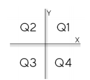

<h1 align="center">Aprendendo C# e POO</h1>

<p align="center">Projeto que criei para ministrar aulas de programação com C# e POO.</p>

## :clipboard: Tópicos

**Desafios**

* [Desafio 01](https://github.com/YuriSiman/learn-csharp-oop#desafio-01)  
* [Desafio 02](https://github.com/YuriSiman/learn-csharp-oop#desafio-02)  
* [Desafio 03](https://github.com/YuriSiman/learn-csharp-oop#desafio-03)  
* [Desafio 04](https://github.com/YuriSiman/learn-csharp-oop#desafio-04)  
* [Desafio 05](https://github.com/YuriSiman/learn-csharp-oop#desafio-05)  
* [Desafio 06](https://github.com/YuriSiman/learn-csharp-oop#desafio-06)  
* [Desafio 07](https://github.com/YuriSiman/learn-csharp-oop#desafio-07)  
* [Desafio 08](https://github.com/YuriSiman/learn-csharp-oop#desafio-08)  
* [Desafio 09](https://github.com/YuriSiman/learn-csharp-oop#desafio-09)  
* [Desafio 10](https://github.com/YuriSiman/learn-csharp-oop#desafio-10)  
* [Desafio 11](https://github.com/YuriSiman/learn-csharp-oop#desafio-11)  
* [Desafio 12](https://github.com/YuriSiman/learn-csharp-oop#desafio-12)  
* [Desafio 13](https://github.com/YuriSiman/learn-csharp-oop#desafio-13)  
* [Desafio 14](https://github.com/YuriSiman/learn-csharp-oop#desafio-14)  
* [Desafio 15](https://github.com/YuriSiman/learn-csharp-oop#desafio-15)  
* [Desafio 16](https://github.com/YuriSiman/learn-csharp-oop#desafio-16)  
* [Desafio 17](https://github.com/YuriSiman/learn-csharp-oop#desafio-17)  
* [Desafio 18](https://github.com/YuriSiman/learn-csharp-oop#desafio-18)  
* [Desafio 19](https://github.com/YuriSiman/learn-csharp-oop#desafio-19)  
* [Desafio 20](https://github.com/YuriSiman/learn-csharp-oop#desafio-20)  
* [Desafio 21](https://github.com/YuriSiman/learn-csharp-oop#desafio-21)  
* [Desafio 22](https://github.com/YuriSiman/learn-csharp-oop#desafio-22)  
* [Desafio 23](https://github.com/YuriSiman/learn-csharp-oop#desafio-23)  
* [Desafio 24](https://github.com/YuriSiman/learn-csharp-oop#desafio-24)  
* [Desafio 25](https://github.com/YuriSiman/learn-csharp-oop#desafio-25)  

---

### :dart: Objetivo

Tenho como objetivo reunir neste projeto exercícios de lógica de programação que venho realizando junto aos meus estudos sobre a linguagem e programação, para que se possa ter, em fácil acesso, as questões e soluções implementadas. Que possa servir como fonte de estudos e consultas.  

### Clone

Clone este repositório em sua máquina local usando:

```
git clone https://github.com/YuriSiman/learn-csharp-oop.git
```

---

## :rocket: Vamos Começar

## Lógica de Programação

## Desafio 01  
Faça um programa para ler dois valores inteiros, e depois mostrar na tela a soma desses números com uma mensagem explicativa, conforme exemplos:

Exemplo de Entrada | Exemplo de Saída
------------ | -------------
10  
30 | SOMA = 40

Exemplo de Entrada | Exemplo de Saída
------------ | -------------
-30  
10 | SOMA = -20

Exemplo de Entrada | Exemplo de Saída
------------ | -------------
0  
0 | SOMA = 0

* [Voltar ao Início](https://github.com/YuriSiman/learn-csharp-oop#aprendendo-c-e-poo)  

---

## Desafio 02  
Faça um programa para ler o valor do diâmetro de um círculo e, com isso, calcular o seu raio. Depois mostrar o valor da área deste círculo com quatro casas decimais conforme exemplos:  

Fórmula da área: area = π . raio^2
Considere o valor de π = 3.14159

Exemplo de Entrada | Exemplo de Saída
------------ | -------------
2.00 | A = 3.1416

Exemplo de Entrada | Exemplo de Saída
------------ | -------------
100.64 | A = 7954.8276

Exemplo de Entrada | Exemplo de Saída
------------ | -------------
150.00 | A = 17671.4437

* [Voltar ao Início](https://github.com/YuriSiman/learn-csharp-oop#aprendendo-c-e-poo)  

---

## Desafio 03  
Fazer um programa para ler quatro valores inteiros A, B, C e D. A seguir, calcule e mostre a diferença do produto de A e B pelo produto de C e D.

Exemplo de Entrada | Exemplo de Saída
------------ | -------------
5  
6  
7  
8 | DIFERENÇA = -26

Exemplo de Entrada | Exemplo de Saída
------------ | -------------
5  
6  
-7  
8 | DIFERENÇA = 86

* [Voltar ao Início](https://github.com/YuriSiman/learn-csharp-oop#aprendendo-c-e-poo)  

---

## Desafio 04  
Fazer um programa que leia o número de um funcionário, seu número de horas trabalhadas, o valor que recebe por hora e calcula o salário desse funcionário. A seguir, mostre o número e o salário do funcionário, com duas casas decimais.

Exemplo de Entrada | Exemplo de Saída
------------ | -------------
25  
100  
5.50 | Número: 25  Salário: R$ 550,00

Exemplo de Entrada | Exemplo de Saída
------------ | -------------
1  
200  
20.50 | Número: 1  Salário: R$ 4100,00

Exemplo de Entrada | Exemplo de Saída
------------ | -------------
6  
145  
15.55 | Número: 6  Salário: R$ 2254,75

* [Voltar ao Início](https://github.com/YuriSiman/learn-csharp-oop#aprendendo-c-e-poo)  

---

## Desafio 05  
Fazer um programa para ler o código de uma peça 1, o número de peças 1, o valor unitário de cada peça 1, o código de uma peça 2, o número de peças 2 e o valor unitário de cada peça 2. Calcule e mostre o valor a ser pago.

Exemplo de Entrada | Exemplo de Saída
------------ | -------------
12   1   5.30    
16   2   5.10 | Valor a pagar: R$ 15,50

Exemplo de Entrada | Exemplo de Saída
------------ | -------------
13   2   15.30    
161   4   5.20 | Valor a pagar: R$ 51,40

Exemplo de Entrada | Exemplo de Saída
------------ | -------------
1   1   15.10    
2   1   15.10 | Valor a pagar: R$ 30,20

* [Voltar ao Início](https://github.com/YuriSiman/learn-csharp-oop#aprendendo-c-e-poo)  

---

## Desafio 06  
Fazer um programa que leia três valores com ponto flutuante de dupla precisão: A, B e C. Em seguida, calcule e mostre:  

- a área do triângulo retângulo que tem A por base e C por altura.   
- a área do círculo de raio C. (pi = 3.14159)  
- a área do trapézio que tem A e B por bases e C por altura.  
- a área do quadrado que tem lado B.  
- a área do retângulo que tem lados A e B  

Exemplo de Entrada | Exemplo de Saída
------------ | -------------
3.0 4.0 5.2 | TRIÂNGULO: 7.800   CÍRCULO: 84.949   TRAPÉZIO: 18.200   QUADRADO: 16.000   RETÂNGULO: 12.000

Exemplo de Entrada | Exemplo de Saída
------------ | -------------
12.7 10.4 15.2 | TRIÂNGULO: 96.520   CÍRCULO: 725.833   TRAPÉZIO: 175.560   QUADRADO: 108.160   RETÂNGULO: 132.080

* [Voltar ao Início](https://github.com/YuriSiman/learn-csharp-oop#aprendendo-c-e-poo)  

---

## Desafio 07  
Fazer um programa para ler um número inteiro, e depois dizer se este número é negativo ou não.  

Exemplo de Entrada | Exemplo de Saída
------------ | -------------
-10 | NEGATIVO

Exemplo de Entrada | Exemplo de Saída
------------ | -------------
8 | NÃO NEGATIVO

Exemplo de Entrada | Exemplo de Saída
------------ | -------------
0 | NÃO NEGATIVO

* [Voltar ao Início](https://github.com/YuriSiman/learn-csharp-oop#aprendendo-c-e-poo)  

---

## Desafio 08  
Fazer um programa para ler um número inteiro e dizer se este número é par ou ímpar.  

Exemplo de Entrada | Exemplo de Saída
------------ | -------------
12 | PAR

Exemplo de Entrada | Exemplo de Saída
------------ | -------------
-27 | ÍMPAR

Exemplo de Entrada | Exemplo de Saída
------------ | -------------
0 | PAR

* [Voltar ao Início](https://github.com/YuriSiman/learn-csharp-oop#aprendendo-c-e-poo)  

---

## Desafio 09  
Leia 2 valores inteiros (A e B). Após, o programa deve mostrar uma mensagem "São Múltiplos" ou "Não são Múltiplos", indicando se os valores lidos são múltiplos entre si. Atenção: os números devem poder ser digitados em ordem crescente ou decrescente.

Exemplo de Entrada | Exemplo de Saída
------------ | -------------
6  24 | São múltiplos

Exemplo de Entrada | Exemplo de Saída
------------ | -------------
6  25 | Não são múltiplos

Exemplo de Entrada | Exemplo de Saída
------------ | -------------
24  6 | São Múltiplos

* [Voltar ao Início](https://github.com/YuriSiman/learn-csharp-oop#aprendendo-c-e-poo)  

---

## Desafio 10  
Leia a hora inicial e a hora final de um jogo. A seguir calcule a duração do jogo, sabendo que o mesmo pode começar em um dia e terminar em outro, tendo uma duração mínima de 1 hora e máxima de 24 horas.

Exemplo de Entrada | Exemplo de Saída
------------ | -------------
16  2 | O jogo durou 10 horas

Exemplo de Entrada | Exemplo de Saída
------------ | -------------
0  0 | O jogo durou 24 horas

Exemplo de Entrada | Exemplo de Saída
------------ | -------------
2  16 | O jogo durou 14 horas

* [Voltar ao Início](https://github.com/YuriSiman/learn-csharp-oop#aprendendo-c-e-poo)  

---

## Desafio 11  
Com base na tabela abaixo, escreva um programa que leia o código de um item e a quantidade deste item. A seguir, calcule e mostre o valor da conta a pagar.

Código | Especificação | Preço
------------ | ------------- | -------------
1 | Cachorro Quente | R$ 4,00
2 | X-Salada | R$ 4,50
3 | X-Bacon | R$ 5,00
4 | Torrada Simples | R$ 2,00
5 | Refrigerante | R$ 1,50

Exemplo de Entrada | Exemplo de Saída
------------ | -------------
3  2 | Total: R$ 10,00

Exemplo de Entrada | Exemplo de Saída
------------ | -------------
2  3 | Total: R$ 13,50

* [Voltar ao Início](https://github.com/YuriSiman/learn-csharp-oop#aprendendo-c-e-poo)  

---

## Desafio 12  
Você deve fazer um programa que leia um valor qualquer e apresente uma mensagem dizendo em qual dos seguintes intervalos (0,25), (25,50), (50,75), (75,100) este valor se encontra. Obviamente se o valor não estiver em nenhum destes intervalos, deverá ser impressa a mensagem “Fora de intervalo”.

Exemplo de Entrada | Exemplo de Saída
------------ | -------------
25.01 | Intervalo (25,50)

Exemplo de Entrada | Exemplo de Saída
------------ | -------------
25.00 | Intervalo (0, 25)

Exemplo de Entrada | Exemplo de Saída
------------ | -------------
100.00 | Intervalo (75,100)

Exemplo de Entrada | Exemplo de Saída
------------ | -------------
-25.02 | Fora de intervalo

* [Voltar ao Início](https://github.com/YuriSiman/learn-csharp-oop#aprendendo-c-e-poo)  

---

## Desafio 13  
Leia 2 valores com uma casa decimal (x e y), que devem representar as coordenadas de um ponto em um plano. A seguir, determine qual o quadrante ao qual pertence o ponto, ou se está sobre um dos eixos cartesianos ou na origem (x = y = 0). Se o ponto estiver na origem, escreva a mensagem “Origem”. Se o ponto estiver sobre um dos eixos escreva “Eixo X” ou “Eixo Y”, conforme for a situação.



Exemplo de Entrada | Exemplo de Saída
------------ | -------------
4.5  -2.2 | Q4

Exemplo de Entrada | Exemplo de Saída
------------ | -------------
0.1  0.1 | Q1

Exemplo de Entrada | Exemplo de Saída
------------ | -------------
0.0  0.0 | Origem

* [Voltar ao Início](https://github.com/YuriSiman/learn-csharp-oop#aprendendo-c-e-poo)  

---

## Desafio 14  
Em um país imaginário denominado Lisarb, todos os habitantes ficam felizes em pagar seus impostos, pois sabem que nele não existem políticos corruptos e os recursos arrecadados são utilizados em benefício da população, sem qualquer desvio. A moeda deste país é o Rombus, cujo símbolo é o R$. Leia um valor com duas casas decimais, equivalente ao salário de uma pessoa de Lisarb. Em seguida, calcule e mostre o valor que esta pessoa deve pagar de Imposto de Renda, segundo a tabela abaixo:

Renda | Imposto de Renda
------------ | -------------
de 0,00 a R$ 2000,00 | Isento
de R$ 2000,01 até R$ 3000,00 | 8%
de R$ 3000,01 até R$ 4500,00 | 18%
acima de R$ 4500,00 | 28%

Lembre que, se o salário for R$ 3002.00, a taxa que incide é de 8% apenas sobre R$ 1000.00, pois a faixa de salário que fica de R$ 0.00 até R$ 2000.00 é isenta de Imposto de Renda. No exemplo fornecido (abaixo), a taxa é de 8% sobre R$ 1000.00 + 18% sobre R$ 2.00, o que resulta em R$ 80.36 no total. O valor deve ser impresso com duas casas decimais.

Exemplo de Entrada | Exemplo de Saída
------------ | -------------
3002.00 | R$ 80.36

Exemplo de Entrada | Exemplo de Saída
------------ | -------------
1701.12 | Isento

Exemplo de Entrada | Exemplo de Saída
------------ | -------------
4520.00 | R$ 355.60

* [Voltar ao Início](https://github.com/YuriSiman/learn-csharp-oop#aprendendo-c-e-poo)  

---

## Desafio 15  
Escreva um programa que repita a leitura de uma senha até que ela seja válida. Para cada leitura de senha incorreta informada, escrever a mensagem "Senha Invalida". Quando a senha for informada corretamente deve ser impressa a mensagem "Acesso Permitido" e o algoritmo encerrado. Considere que a senha correta é o valor 2002.

Exemplo de Entrada | Exemplo de Saída
------------ | -------------
2200 | Senha Inválida

Exemplo de Entrada | Exemplo de Saída
------------ | -------------
1020 | Senha Inválida

Exemplo de Entrada | Exemplo de Saída
------------ | -------------
2022 | Senha Inválida

Exemplo de Entrada | Exemplo de Saída
------------ | -------------
2002 | Acesso Permitido

* [Voltar ao Início](https://github.com/YuriSiman/learn-csharp-oop#aprendendo-c-e-poo)  

---

## Desafio 16  
Escreva um programa para ler as coordenadas (X,Y) de uma quantidade indeterminada de pontos no sistema cartesiano. Para cada ponto escrever o quadrante a que ele pertence. O algoritmo será encerrado quando pelo menos uma de duas coordenadas for NULA (nesta situação sem escrever mensagem alguma).

Exemplo de Entrada | Exemplo de Saída
------------ | -------------
2  2 | Primeiro

Exemplo de Entrada | Exemplo de Saída
------------ | -------------
3  -2 | Quarto

Exemplo de Entrada | Exemplo de Saída
------------ | -------------
-8  -1 | Terceiro

Exemplo de Entrada | Exemplo de Saída
------------ | -------------
-7  1 | Segundo

Exemplo de Entrada | Exemplo de Saída
------------ | -------------
0  2 | 

* [Voltar ao Início](https://github.com/YuriSiman/learn-csharp-oop#aprendendo-c-e-poo)  

---

## Desafio 17  
Um Posto de combustíveis deseja determinar qual de seus produtos tem a preferência de seus clientes. Escreva um algoritmo para ler o tipo de combustível abastecido (codificado da seguinte forma: 1.Álcool 2.Gasolina 3.Diesel 4.Fim). Caso o usuário informe um código inválido (fora da faixa de 1 a 4) deve ser solicitado um novo código (até 
que seja válido). O programa será encerrado quando o código informado for o número 4. Deve ser escrito a mensagem: "MUITO OBRIGADO" e a quantidade de clientes que abasteceram cada tipo de combustível, conforme exemplo.

Exemplo de Entrada | Exemplo de Saída
------------ | -------------
8 | Muito Obrigado
1 | Álcool: 1
7 | Gasolina: 2
2 | Diesel: 0
2 | 
4 | 

* [Voltar ao Início](https://github.com/YuriSiman/learn-csharp-oop#aprendendo-c-e-poo)  

---

## Desafio 18  
Leia um valor inteiro X (1 <= X <= 1000). Em seguida mostre os ímpares de 1 até X, um valor por linha, inclusive o X, se for o caso.

Exemplo de Entrada | Exemplo de Saída
------------ | -------------
8 | 1   
  | 3
  | 5
  | 7

* [Voltar ao Início](https://github.com/YuriSiman/learn-csharp-oop#aprendendo-c-e-poo)  

---

## Desafio 19  
Leia um valor inteiro N. Este valor será a quantidade de valores inteiros X que serão lidos em seguida. Mostre quantos destes valores X estão dentro do intervalo [10,20] e quantos estão fora do intervalo, mostrando essas informações conforme exemplo (use a palavra "in" para dentro do intervalo, e "out" para fora do intervalo).

Exemplo de Entrada | Exemplo de Saída
------------ | -------------
5  
14  
123  
10  
-25  
32 | 2 in   3 out

* [Voltar ao Início](https://github.com/YuriSiman/learn-csharp-oop#aprendendo-c-e-poo)  

---

## Desafio 20  
Leia 1 valor inteiro N, que representa o número de casos de teste que vem a seguir. Cada caso de teste consiste de 3 valores reais, cada um deles com uma casa decimal. Apresente a média ponderada para cada um destes conjuntos de 3 valores, sendo que o primeiro valor tem peso 2, o segundo valor tem peso 3 e o terceiro valor tem peso 5.

Exemplo de Entrada | Exemplo de Saída
------------ | -------------
3 | 
6.5  4.3  6.2 | 5.7
5.1  4.2  8.1 | 6.3
8.0  9.0  10.0 | 9.3

* [Voltar ao Início](https://github.com/YuriSiman/learn-csharp-oop#aprendendo-c-e-poo)  

---

## Desafio 21  
Fazer um programa para ler um número N. Depois leia N pares de números e mostre a divisão do primeiro pelo segundo. Se o denominador for igual a zero, mostrar a mensagem "divisao impossivel".

Exemplo de Entrada | Exemplo de Saída
------------ | -------------
3 |
3  -2 | -1.5
-8  0 | Divisão Impossível
0  8 | 0.0

* [Voltar ao Início](https://github.com/YuriSiman/learn-csharp-oop#aprendendo-c-e-poo)  

---

## Desafio 22  
Ler um valor N. Calcular e escrever seu respectivo fatorial. Fatorial de N = N * (N-1) * (N-2) * (N-3) * ... * 1. Lembrando que, por definição, fatorial de 0 é 1.

Exemplo de Entrada | Exemplo de Saída
------------ | -------------
4 | 24

Exemplo de Entrada | Exemplo de Saída
------------ | -------------
1 | 1

Exemplo de Entrada | Exemplo de Saída
------------ | -------------
5 | 120

Exemplo de Entrada | Exemplo de Saída
------------ | -------------
0 | 1

* [Voltar ao Início](https://github.com/YuriSiman/learn-csharp-oop#aprendendo-c-e-poo)  

---

## Desafio 23  
Ler um número inteiro N e calcular todos os seus divisores.

Exemplo de Entrada | Exemplo de Saída
------------ | -------------
6 | 1  2  3  6

* [Voltar ao Início](https://github.com/YuriSiman/learn-csharp-oop#aprendendo-c-e-poo)  

---

## Desafio 24  
Fazer um programa para ler um número inteiro positivo N. O programa deve então mostrar na tela N linhas, começando de 1 até N. Para cada linha, mostrar o número da linha, depois o quadrado e o cubo do valor, conforme exemplo.

Exemplo de Entrada | Exemplo de Saída
------------ | -------------
5 |
  | 1 1 1
  | 2 4 8
  | 3 9 27
  | 4 16 64
  | 5 25 125

* [Voltar ao Início](https://github.com/YuriSiman/learn-csharp-oop#aprendendo-c-e-poo)  

---

## Desafio 25  
Fazer um programa que imprima no console o desenho abaixo:

```
*
**
***
****
*****
******
*******
********
*********
**********
```

* [Voltar ao Início](https://github.com/YuriSiman/learn-csharp-oop#aprendendo-c-e-poo)  

---

## :vertical_traffic_light: Status do Projeto

:construction: Exercícios sendo implementados :construction:

---

## :thinking: Contribuindo

> Para começar...

### Passo 1

* :fork_and_knife: Fork este repositório!

### Passo 2

* :dancers: Clone este repositório para sua máquina local usando `git clone https://github.com/YuriSiman/learn-csharp-oop.git`

### Passo 3

* :trident: Crie sua feature branch usando `git checkout -b minha-feature`

### Passo 4

* :white_check_mark: Commit suas mudanças usando `git commit -m "feat: Minha nova feature"`

### Passo 5

* :pushpin: Dê um push usando `git push -u origin minha-feature`

### Passo 6

* :arrows_clockwise: Crie um novo pull request

Depois que seu pull request for mesclado, você pode excluir sua feature branch  

> Caso tenha dúvidas, confira este guia de como [contribuir no GitHub](https://github.com/firstcontributions/first-contributions)  

---

## :speech_balloon: Suporte

> Entre em contato comigo...  

* Me chame pelo [Linkedin](https://www.linkedin.com/in/yurisiman/)  
* Me mande um e-mail [contato@yurisiman.com.br](mailto:contato@yurisiman.com.br)  

[](https://github.com/YuriSiman)  
[](https://yurisiman.com.br)  

---

## :pencil: Licença

[](https://github.com/YuriSiman/learn-csharp-oop/blob/master/LICENSE)  

---

Code your life...
