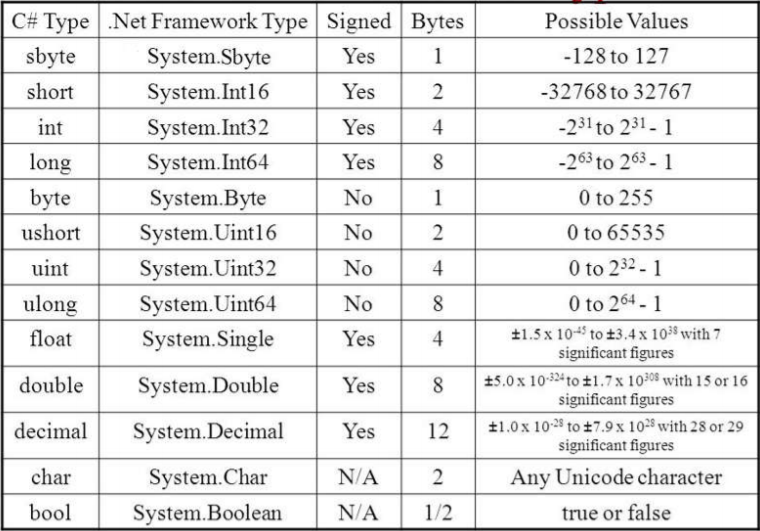

<h1 align="center">Exercícios de Lógica de Programação em C#</h1>

<p align="center">Neste projeto encontram-se exercícios de lógica de programação que venho realizando junto aos meus estudos sobre a linguagem, estão contidos exercícios de nível básico ao avançado. Busco apontar questões fundamentais da linguagem nos exercícios básicos e questões elaboradas nos exercícios intermediários e avançados.</p>

## :clipboard: Tópicos - Exercícios em C# 

Básico
* [Tipos Básicos de Dados em C#](https://github.com/YuriSiman/exercises-csharp#tipos-b%C3%A1sicos-de-dados-em-c)  

Intermediário
* [Pilha](https://github.com/YuriSiman/exercises-csharp/#pilha)  

Avançado

---

### :dart: Objetivo

Tenho como objetivo reunir neste projeto exercícios de lógica de programação que venho realizando junto aos meus estudos sobre a linguagem e programação, para que se possa ter, em fácil acesso, as questões e soluções implementadas. Que possa servir como fonte de estudos e consultas.  

### Clone

Clone este repositório em sua máquina local usando:

```
git clone https://github.com/YuriSiman/exercises-csharp.git
```

---

## :rocket: Vamos Começar - Exercícios em C#  

## Tipos Básicos de Dados em C#




**Desafio**  
Informe quais são os valores máximos e mínimos dos tipos abaixo:

```
sbyte
short
int
long
byte
ushort
uint
ulong
float
double
decimal
```

Obs: Crie variáveis para receber os valores referente ao máximo e mínimo de cada tipo.

* [Visualizar Código](https://github.com/YuriSiman/exercises-csharp/tree/master/src/2%20-%20intermedi%C3%A1rio/Pilha.ConsoleApp)  
* [Voltar ao Início](https://github.com/YuriSiman/exercises-csharp#exerc%C3%ADcios-de-l%C3%B3gica-de-programa%C3%A7%C3%A3o-em-c)  

---

## Pilha

Pilhas - Stack. São estruturas de dados do tipo LIFO (last-in first-out), onde o último elemento a ser inserido, será o primeiro a ser retirado. Assim, uma pilha permite acesso a apenas um item de dados - o último inserido. Para processar o penúltimo item inserido, deve-se remover o último.

**Desafio**  
Desenvolva um programa que receba do usuário 3 dados e empilhe isso em uma estrutura de Pilha, sendo que, ao desenpilhar os dados, deve-se respeitar o tipo LIFO (last-in first-out).

* [Visualizar Código](https://github.com/YuriSiman/exercises-csharp/tree/master/src/2%20-%20intermedi%C3%A1rio/Pilha.ConsoleApp)  
* [Voltar ao Início](https://github.com/YuriSiman/exercises-csharp#exerc%C3%ADcios-de-l%C3%B3gica-de-programa%C3%A7%C3%A3o-em-c)  

---

## :vertical_traffic_light: Status do Projeto

:construction: Exercícios sendo implementados :construction:

---

## :thinking: Contribuindo

> Para começar...

### Passo 1

* :fork_and_knife: Fork este repositório!

### Passo 2

* :dancers: Clone este repositório para sua máquina local usando `git clone https://github.com/YuriSiman/exercises-csharp.git`

### Passo 3

* :trident: Crie sua feature branch usando `git checkout -b minha-feature`

### Passo 4

* :white_check_mark: Commit suas mudanças usando `git commit -m "feat: Minha nova feature"`

### Passo 5

* :pushpin: Dê um push usando `git push -u origin minha-feature`

### Passo 6

* :arrows_clockwise: Crie um novo pull request

Depois que seu pull request for mesclado, você pode excluir sua feature branch  

> Caso tenha dúvidas, confira este guia de como [contribuir no GitHub](https://github.com/firstcontributions/first-contributions)  

---

## :speech_balloon: Suporte

> Entre em contato comigo...  

* Me chame pelo [Linkedin](https://www.linkedin.com/in/yurisiman/)  
* Me mande um e-mail [contato@yurisiman.com.br](mailto:contato@yurisiman.com.br)  

[](https://github.com/YuriSiman)  
[](https://yurisiman.com.br)  

---

## :pencil: Licença

[](https://github.com/YuriSiman/exercises-csharp/blob/master/LICENSE)   

---

Code your life...
