<div id="top"></div>

<br/>
<div align="center">
    
    <h1 align="center">Lógica de Programação e POO com C#</h1>
    <p align="center">Desafios para praticar e aprender</p>
</div>

<br/>

<div align="center">
    <a href="https://github.com/YuriSiman/learn-csharp-oop/blob/master/LICENSE" target="_blank">
      
    </a>
    <a href="https://github.com/YuriSiman" target="_blank">
      
    </a>
    <a href="https://yurisiman.com.br" target="_blank">
      
    </a>
    <a href="https://www.linkedin.com/in/yurisiman/" target="_blank">
      
    </a>
    <a href="mailto:contato@yurisiman.com.br" target="_blank">
      
    </a>
</div>

<br/>

## :clipboard: Sobre o Projeto

Este repositório tem como objetvo reunir diversos exercícios de lógica de programação e POO para que você possa estudar e aprender na prática concluindos desafios, seja você um iniciante ou alguém mais avançado. O código com as resoluções dos desafios está escrito em C# e possui um link direto no final de cada exercício. 

Bem, agora é só abrir sua IDE preferida e pegar uma boa xícara de café! Bons estudos! :smiley::coffee:

---

## :pencil: Pré-requisitos

1. Construído com .NET 6.0 e codificado em C#, se você não possui o dotnet instalado, acesse [aqui](https://dotnet.microsoft.com/) e instale a versão mais recente.
2. Clone este repositório em sua máquina local

   ```sh
   git clone https://github.com/YuriSiman/learn-csharp-oop.git
   ```

---

## :dart: Tabela de Desafios

<details>
  <summary>Lógica de Programação</summary>
  <ul>
    <li><a href="#desafio01">Desafio 01</a></li>
    <li><a href="#desafio02">Desafio 02</a></li>
    <li><a href="#desafio03">Desafio 03</a></li>
    <li><a href="#desafio04">Desafio 04</a></li>
    <li><a href="#desafio05">Desafio 05</a></li>
    <li><a href="#desafio06">Desafio 06</a></li>
    <li><a href="#desafio07">Desafio 07</a></li>
    <li><a href="#desafio08">Desafio 08</a></li>
    <li><a href="#desafio09">Desafio 09</a></li>
    <li><a href="#desafio10">Desafio 10</a></li>
    <li><a href="#desafio11">Desafio 11</a></li>
    <li><a href="#desafio12">Desafio 12</a></li>
    <li><a href="#desafio13">Desafio 13</a></li>
    <li><a href="#desafio14">Desafio 14</a></li>
    <li><a href="#desafio15">Desafio 15</a></li>
    <li><a href="#desafio16">Desafio 16</a></li>
    <li><a href="#desafio17">Desafio 17</a></li>
    <li><a href="#desafio18">Desafio 18</a></li>
    <li><a href="#desafio19">Desafio 19</a></li>
    <li><a href="#desafio20">Desafio 20</a></li>
    <li><a href="#desafio21">Desafio 21</a></li>
    <li><a href="#desafio22">Desafio 22</a></li>
    <li><a href="#desafio23">Desafio 23</a></li>
    <li><a href="#desafio24">Desafio 24</a></li>
    <li><a href="#desafio25">Desafio 25</a></li>
    <li><a href="#desafio26">Desafio 26</a></li>
  </ul>
</details>
<details>
  <summary>POO</summary>
  <ul>
    <li><a href="#desafio01-poo">Desafio 01</a></li>
    <li><a href="#desafio02-poo">Desafio 02</a></li>
    <li><a href="#desafio03-poo">Desafio 03</a></li>
    <li><a href="#desafio04-poo">Desafio 04</a></li>
  </ul>
</details>
<details>
  <summary>Collections</summary>
  <ul>
    <li><a href="#desafio01-collections">Desafio 01</a></li>
  </ul>
</details>

---

## :rocket: Vamos Começar

### Lógica de Programação

<div id="desafio01"></div>

### Desafio 01  
Faça um programa para ler as medidas dos lados de dois triângulos X e Y (suponha medidas válidas), em seguida, mostre o valor das áreas dos dois triângulos e também informe qual dos dois triângulos possui a maior área.

A fórmula para calcular a área de um triângulo a partir das medidas de seus lados **a**, **b** e **c** é a seguinte (fórmula de Heron):

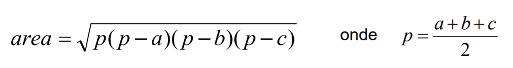

Exemplo de Console:

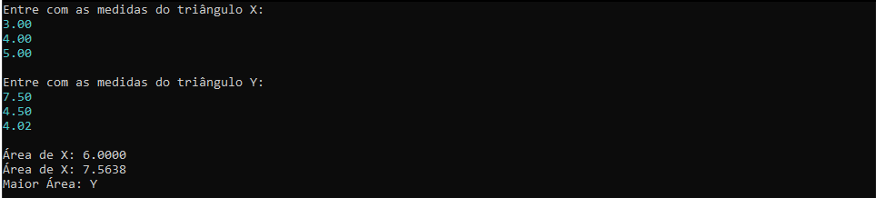

<p align="right"><a href="#top">Início ↑</a></p>

---

<div id="desafio02"></div>

### Desafio 02  
Faça um programa para ler o valor do diâmetro de um círculo e, com isso, calcular o seu raio. Depois mostrar o valor da área deste círculo com quatro casas decimais conforme exemplos:  

Fórmula da área: area = π . raio^2
Considere o valor de π = 3.14159

Exemplo de Console:


<p align="right"><a href="#top">Início ↑</a></p>

---

<div id="desafio03"></div>

### Desafio 03  
Fazer um programa para ler quatro valores inteiros A, B, C e D. A seguir, calcule e mostre a diferença do produto de A e B pelo produto de C e D.

Exemplo de Console:

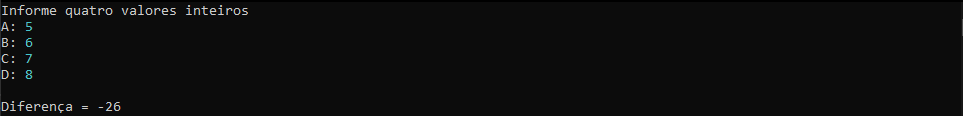

<p align="right"><a href="#top">Início ↑</a></p>

---

<div id="desafio04"></div>

### Desafio 04  
Fazer um programa que leia o número de um funcionário, seu número de horas trabalhadas, o valor que recebe por hora e calcula o salário desse funcionário. A seguir, mostre o número e o salário do funcionário, com duas casas decimais.

Exemplo de Console:

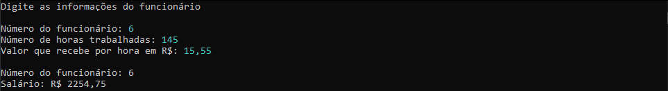

<p align="right"><a href="#top">Início ↑</a></p>

---

<div id="desafio05"></div>

### Desafio 05  
Fazer um programa para ler o código de uma peça 1, o número de peças 1, o valor unitário de cada peça 1, o código de uma peça 2, o número de peças 2 e o valor unitário de cada peça 2. Calcule e mostre o valor a ser pago.

Exemplo de Console:

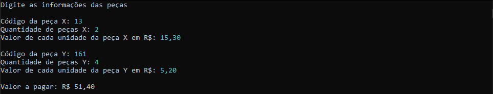

<p align="right"><a href="#top">Início ↑</a></p>  

---

<div id="desafio06"></div>

### Desafio 06  
Fazer um programa que leia três valores com ponto flutuante de dupla precisão: A, B e C. Em seguida, calcule e mostre:  

- a área do triângulo retângulo que tem A por base e C por altura.   
- a área do círculo de raio C. (pi = 3.14159)  
- a área do trapézio que tem A e B por bases e C por altura.  
- a área do quadrado que tem lado B.  
- a área do retângulo que tem lados A e B  

Exemplo de Console:

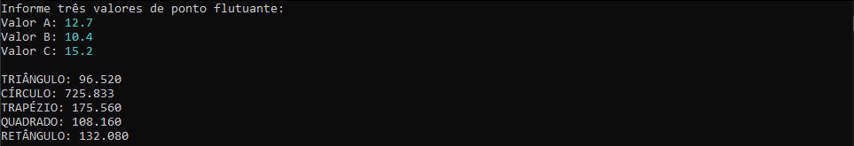

<p align="right"><a href="#top">Início ↑</a></p>

---

<div id="desafio07"></div>

### Desafio 07  
Fazer um programa para ler um número inteiro, e depois dizer se este número é negativo ou não.  

Exemplos de Console:

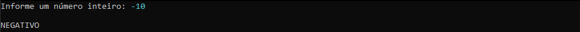
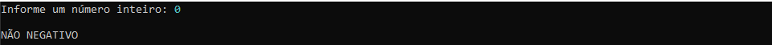

<p align="right"><a href="#top">Início ↑</a></p>

---

<div id="desafio08"></div>

### Desafio 08  
Fazer um programa para ler um número inteiro e dizer se este número é par ou ímpar.  

Exemplos de Console:

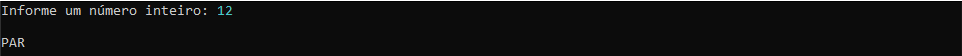
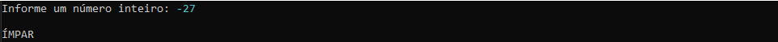

<p align="right"><a href="#top">Início ↑</a></p>

---

<div id="desafio09"></div>

### Desafio 09  
Leia 2 valores inteiros (A e B). Após, o programa deve mostrar uma mensagem "São Múltiplos" ou "Não são Múltiplos", indicando se os valores lidos são múltiplos entre si. Atenção: os números devem poder ser digitados em ordem crescente ou decrescente.

Observação: O número zero pertence ao conjunto dos inteiros e sabemos que qualquer número multiplicado por zero é igual a zero, ou seja, o número zero é múltiplo de todo número inteiro.

Exemplos de Console:


<p align="right"><a href="#top">Início ↑</a></p>

---

<div id="desafio10"></div>

### Desafio 10  
Leia a hora inicial e a hora final de um jogo. A seguir calcule a duração do jogo, sabendo que o mesmo pode começar em um dia e terminar em outro, tendo uma duração mínima de 1 hora e máxima de 24 horas.

Exemplos de Console:

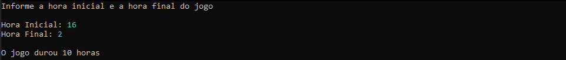
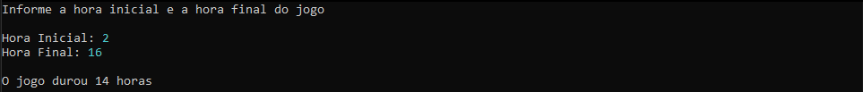
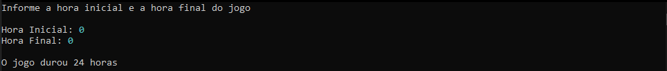

<p align="right"><a href="#top">Início ↑</a></p>

---

<div id="desafio11"></div>

### Desafio 11  
Com base na tabela abaixo, escreva um programa que leia o código de um item e a quantidade deste item. A seguir, calcule e mostre o valor da conta a pagar.

Código | Especificação | Preço
------------ | ------------- | -------------
1 | Cachorro Quente | R$ 4,00
2 | X-Salada | R$ 4,50
3 | X-Bacon | R$ 5,00
4 | Torrada Simples | R$ 2,00
5 | Refrigerante | R$ 1,50

Exemplo de Console:

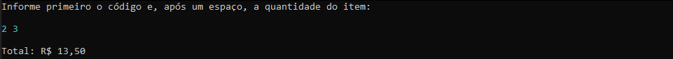

<p align="right"><a href="#top">Início ↑</a></p>

---

<div id="desafio12"></div>

### Desafio 12  
Você deve fazer um programa que leia um valor qualquer e apresente uma mensagem dizendo em qual dos seguintes intervalos (0,25), (25,50), (50,75), (75,100) este valor se encontra. Obviamente se o valor não estiver em nenhum destes intervalos, deverá ser impressa a mensagem “Fora de intervalo”.

Exemplos de Console:

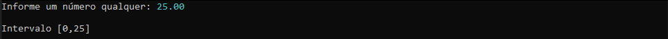
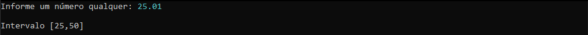
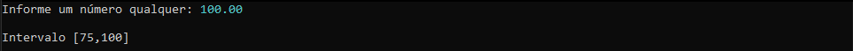


<p align="right"><a href="#top">Início ↑</a></p>

---

<div id="desafio13"></div>

### Desafio 13  
Leia 2 valores com uma casa decimal (x e y), que devem representar as coordenadas de um ponto em um plano. A seguir, determine qual o quadrante ao qual pertence o ponto, ou se está sobre um dos eixos cartesianos ou na origem (x = y = 0). Se o ponto estiver na origem, escreva a mensagem “Origem”. Se o ponto estiver sobre um dos eixos escreva “Eixo X” ou “Eixo Y”, conforme for a situação.


Exemplos de Console:


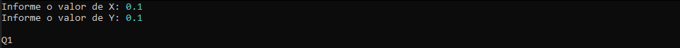
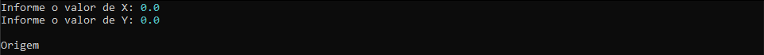

<p align="right"><a href="#top">Início ↑</a></p> 

---

<div id="desafio14"></div>

### Desafio 14  
Em um país imaginário denominado Lisarb, todos os habitantes ficam felizes em pagar seus impostos, pois sabem que nele não existem políticos corruptos e os recursos arrecadados são utilizados em benefício da população, sem qualquer desvio. A moeda deste país é o Rombus, cujo símbolo é o R$. Leia um valor com duas casas decimais, equivalente ao salário de uma pessoa de Lisarb. Em seguida, calcule e mostre o valor que esta pessoa deve pagar de Imposto de Renda, segundo a tabela abaixo:

Renda | Imposto de Renda
------------ | -------------
de 0,00 a R$ 2000,00 | Isento
de R$ 2000,01 até R$ 3000,00 | 8%
de R$ 3000,01 até R$ 4500,00 | 18%
acima de R$ 4500,00 | 28%

Lembre que, se o salário for R$ 3002.00, a taxa que incide é de 8% apenas sobre R$ 1000.00, pois a faixa de salário que fica de R$ 0.00 até R$ 2000.00 é isenta de Imposto de Renda. No exemplo fornecido (abaixo), a taxa é de 8% sobre R$ 1000.00 + 18% sobre R$ 2.00, o que resulta em R$ 80.36 no total. O valor deve ser impresso com duas casas decimais.

Exemplos de Console:

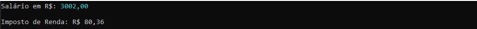
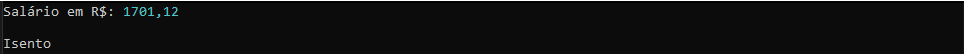
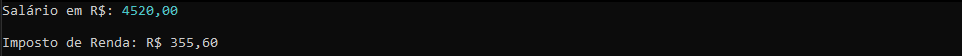

<p align="right"><a href="#top">Início ↑</a></p> 

---

<div id="desafio15"></div>

### Desafio 15  
Escreva um programa que repita a leitura de uma senha até que ela seja válida. Para cada leitura de senha incorreta informada, escrever a mensagem "Senha Invalida". Quando a senha for informada corretamente deve ser impressa a mensagem "Acesso Permitido" e o algoritmo encerrado. Considere que a senha correta é o valor 2002.

Exemplo de Console:

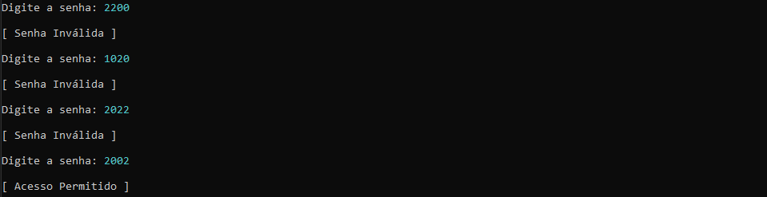

<p align="right"><a href="#top">Início ↑</a></p>

---

<div id="desafio16"></div>

### Desafio 16  
Escreva um programa para ler as coordenadas (X,Y) de uma quantidade indeterminada de pontos no sistema cartesiano. Para cada ponto escrever o quadrante a que ele pertence. O algoritmo será encerrado quando pelo menos uma de duas coordenadas for NULA (nesta situação sem escrever mensagem alguma).

Exemplo de Console:

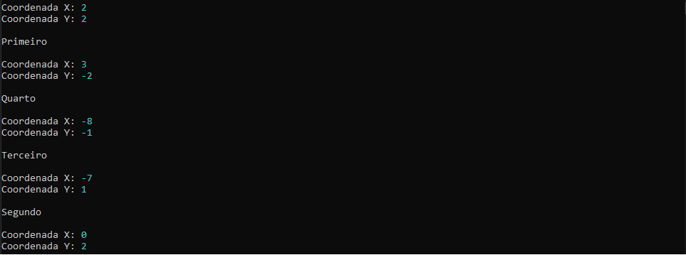

<p align="right"><a href="#top">Início ↑</a></p>

---

<div id="desafio17"></div>

### Desafio 17  
Um Posto de combustíveis deseja determinar qual de seus produtos tem a preferência de seus clientes. Escreva um algoritmo para ler o tipo de combustível abastecido (codificado da seguinte forma: 1.Álcool 2.Gasolina 3.Diesel 4.Fim). Caso o usuário informe um código inválido (fora da faixa de 1 a 4) deve ser solicitado um novo código (até 
que seja válido). O programa será encerrado quando o código informado for o número 4. Deve ser escrito a mensagem: "MUITO OBRIGADO" e a quantidade de clientes que abasteceram cada tipo de combustível, conforme exemplo.

Exemplo de Console:

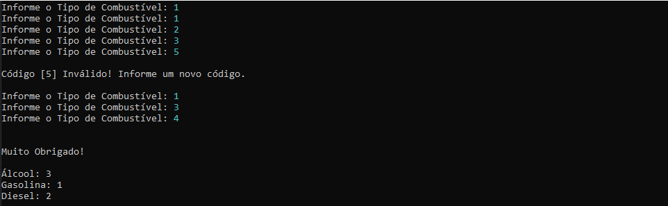

<p align="right"><a href="#top">Início ↑</a></p>

---

<div id="desafio18"></div>

### Desafio 18  
Leia um valor inteiro X (1 <= X <= 1000). Em seguida mostre os ímpares de 1 até X, um valor por linha, inclusive o X, se for o caso.

Exemplo de Console:

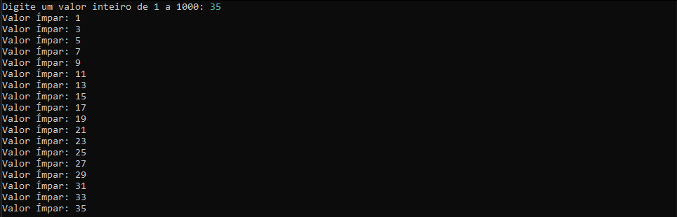

<p align="right"><a href="#top">Início ↑</a></p>

---

<div id="desafio19"></div>

### Desafio 19  
Leia um valor inteiro N. Este valor será a quantidade de valores inteiros X que serão lidos em seguida. Mostre quantos destes valores X estão dentro do intervalo [10,20] e quantos estão fora do intervalo, mostrando essas informações conforme exemplo (use a palavra "in" para dentro do intervalo, e "out" para fora do intervalo).

Exemplo de Console:


<p align="right"><a href="#top">Início ↑</a></p>

---

<div id="desafio20"></div>

### Desafio 20  
Leia 1 valor inteiro N, que representa o número de casos de teste que vem a seguir. Cada caso de teste consiste de 3 valores reais, cada um deles com uma casa decimal. Apresente a média ponderada para cada um destes conjuntos de 3 valores, sendo que o primeiro valor tem peso 2, o segundo valor tem peso 3 e o terceiro valor tem peso 5.

Exemplo de Console:

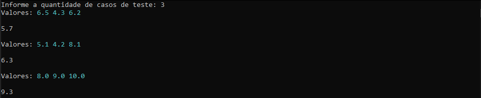

<p align="right"><a href="#top">Início ↑</a></p>

---

<div id="desafio21"></div>

### Desafio 21  
Fazer um programa para ler um número N. Depois leia N pares de números e mostre a divisão do primeiro pelo segundo. Se o denominador for igual a zero, mostrar a mensagem "divisao impossivel".

Exemplo de Console:

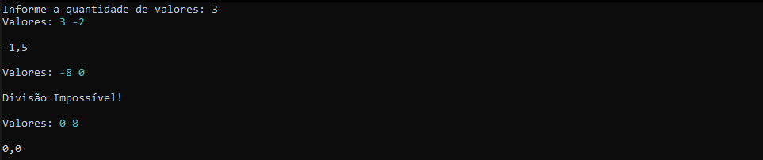

<p align="right"><a href="#top">Início ↑</a></p>

---

<div id="desafio22"></div>

### Desafio 22  
Ler um valor N. Calcular e escrever seu respectivo fatorial. Fatorial de N = N * (N-1) * (N-2) * (N-3) * ... * 1. Lembrando que, por definição, fatorial de 0 é 1.

Exemplo de Console:


<p align="right"><a href="#top">Início ↑</a></p>

---

<div id="desafio23"></div>

### Desafio 23  
Ler um número inteiro N e calcular todos os seus divisores.

Exemplo de Console:

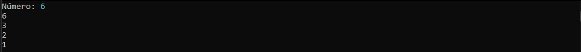

<p align="right"><a href="#top">Início ↑</a></p>

---

<div id="desafio24"></div>

### Desafio 24  
Fazer um programa para ler um número inteiro positivo N. O programa deve então mostrar na tela N linhas, começando de 1 até N. Para cada linha, mostrar o número da linha, depois o quadrado e o cubo do valor, conforme exemplo.

Exemplo de Console:

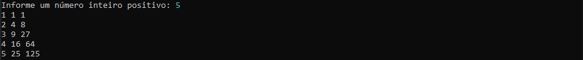

<p align="right"><a href="#top">Início ↑</a></p>

---

<div id="desafio25"></div>

### Desafio 25  
Fazer um programa que imprima no console o desenho abaixo:

Exemplo de Console:

```
*
**
***
****
*****
******
*******
********
*********
**********
```

<p align="right"><a href="#top">Início ↑</a></p>

---

<div id="desafio26"></div>

### Desafio 26  
A dona de um pensionato possui dez quartos para alugar para estudantes, sendo esses quartos identificados pelos números 0 a 9. Quando um estudante deseja alugar um quarto, deve-se registrar o nome
e email deste estudante, assim como o quarto que ele escolher. Faça um programa que inicie com todos os dez quartos vazios e depois leia uma quantidade N representando o número de estudantes que vão
alugar quartos (N pode ser de 1 a 10). Em seguida, registre o aluguel dos N estudantes. Para cada registro de aluguel, informar o nome e email do estudante, bem como qual dos quartos ele escolheu (de 0 a 9). 
Não é permitido escolher um quarto que já está alugado. Ao final, seu programa deve imprimir um relatório de todas ocupações do pensionato, por ordem crescente de quarto, conforme exemplo.

Exemplo de Console:

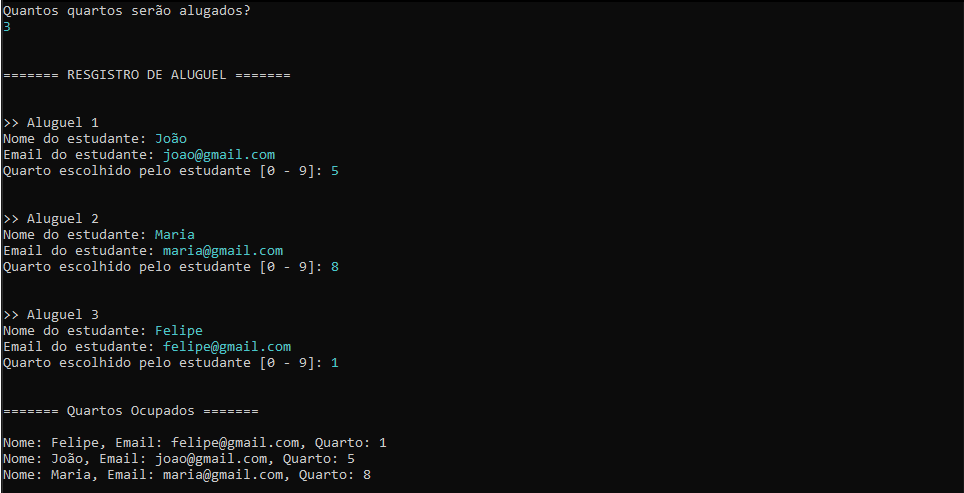

<p align="right"><a href="#top">Início ↑</a></p>

---

### POO

<div id="desafio01-poo"></div>

### Desafio 01  
Faça um programa para ler os valores da base e altura de um retângulo. Em seguida, mostre na tela o valor de sua área, perímetro e diagonal. Use uma classe para representar o Retângulo.

Exemplo de Console:

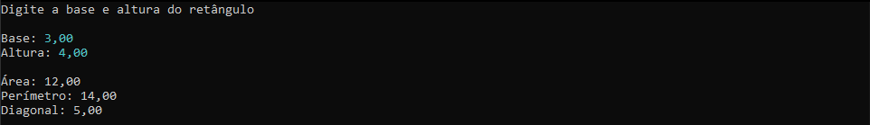

<p align="right"><a href="#top">Início ↑</a></p>

---

<div id="desafio02-poo"></div>

### Desafio 02  
Faça um programa para ler os dados de um funcionário (nome, salário bruto e imposto). Em seguida, mostre os dados do funcionário (nome e salário líquido).
Em seguida, aumente o salário do funcionário com base em uma porcentagem dada (somente o salário bruto é afetado pela porcentagem) e mostre
novamente os dados do funcionário. Use uma classe para representar o Funcionário.

Exemplo de Console:

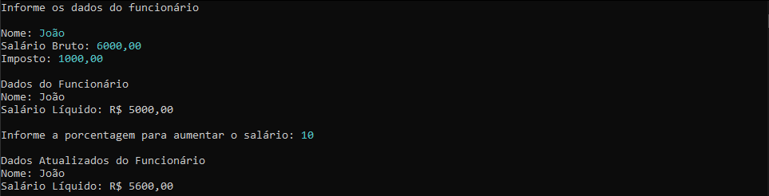

<p align="right"><a href="#top">Início ↑</a></p>

---

<div id="desafio03-poo"></div>

### Desafio 03  
Faça um programa para ler o nome de um aluno e as três notas que ele obteve nos três trimestres do ano (primeiro trimestre vale 30 e o 
segundo e terceiro valem 35 cada). Ao final, mostrar qual a nota final do aluno no ano. Dizer também se o aluno está APROVADO ou REPROVADO e,
em caso negativo, quantos pontos faltam para o aluno obter o mínimo para ser aprovado (que é 60 pontos). Crie uma classe para representar o Aluno.

Exemplo de Console:

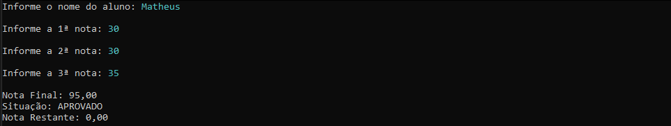

<p align="right"><a href="#top">Início ↑</a></p>

---

<div id="desafio04-poo"></div>

### Desafio 04  
Em um banco, para se cadastrar uma conta bancária, é necessário informar o número da conta, o nome do titular da conta, e o valor de depósito inicial que o titular 
depositou ao abrir a conta. Este valor de depósito inicial, entretanto, é opcional, ou seja: se o titular não tiver dinheiro a depositar no momento de abrir sua
conta, o depósito inicial não será feito e o saldo inicial da conta será, naturalmente, zero. **Importante**: uma vez que uma conta bancária foi aberta, o número da 
conta nunca poderá ser alterado. Já o nome do titular pode ser alterado (pois uma pessoa pode mudar de nome por ocasião de casamento, por
exemplo). Por fim, o saldo da conta não pode ser alterado livremente. É preciso haver um mecanismo para proteger isso. O saldo só aumenta por meio de depósitos, e 
só diminui por meio de saques. Para cada saque realizado, o banco cobra uma taxa de $ 5.00. Nota: a conta pode ficar com saldo negativo se o saldo não for
suficiente para realizar o saque e/ou pagar a taxa. Você deve fazer um programa que realize o cadastro de uma conta, dando opção para que seja ou não
informado o valor de depósito inicial. Em seguida, realizar um depósito e depois um saque, sempre mostrando os dados da conta após cada operação.

Criei uma classe para representar a ContaBancaria. Crie um MENU para mostrar ao usuário as opções do sistema bancário conforme o exemplo de entrada abaixo.

Exemplo de Console:

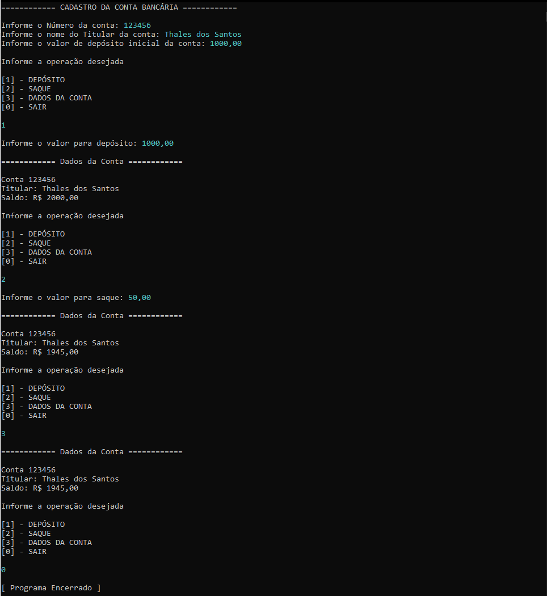

<p align="right"><a href="#top">Início ↑</a></p>

---

### Collections

<div id="desafio01-collections"></div>

### Desafio 01  
Faça um programa para ler um número inteiro N e depois os dados (id, nome e salário) de N funcionários. Não deve ter repetição de id. Em seguida, efetue o aumento de X por cento no salário de um determinado funcionário. 
Para isso, o programa deve ler um id e o valor X. Se o id informado não existir, mostre uma mensagem e aborte a operação. Ao final, mostre a listagem atualizada dos funcionários. Lembre-se de aplicar a técnica de encapsulamento
para não permitir que o salário possa ser mudado livremente. Um salário só poderá ser aumentado com base em uma operação de aumento por porcentagem dada.

Exemplo de Console:

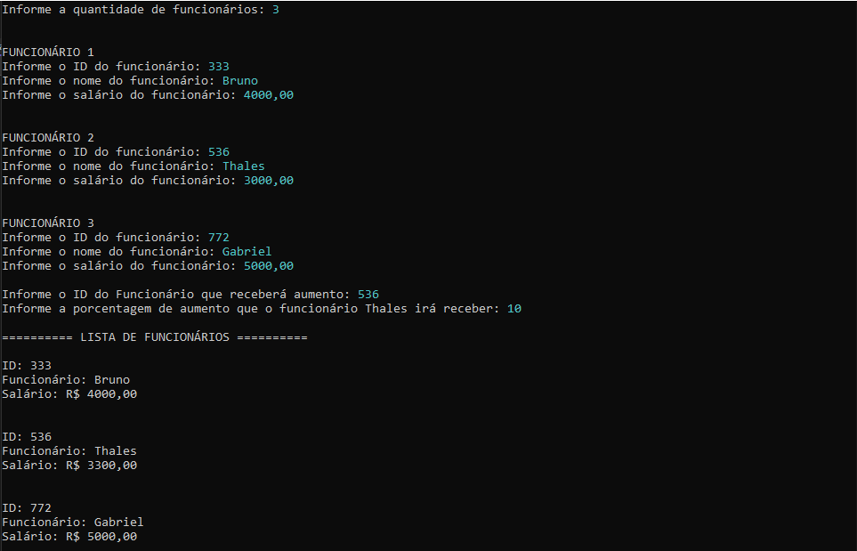

<p align="right"><a href="#top">Início ↑</a></p>

---

## :vertical_traffic_light: Status do Projeto

:construction: Exercícios sendo implementados :construction:

---

## :thinking: Contribuindo

> Passo a passo de como contribuir...

### Passo 1

* :fork_and_knife: Fork este repositório!

### Passo 2

* :dancers: Clone este repositório para sua máquina local usando `git clone https://github.com/YuriSiman/learn-csharp-oop.git`

### Passo 3

* :trident: Crie sua feature branch usando `git checkout -b minha-feature`

### Passo 4

* :white_check_mark: Commit suas mudanças usando `git commit -m "feat: Minha nova feature"`

### Passo 5

* :pushpin: Dê um push usando `git push -u origin minha-feature`

### Passo 6

* :arrows_clockwise: Crie um novo pull request

Depois que seu pull request for mesclado, você pode excluir sua feature branch  

> Caso tenha dúvidas, confira este guia de como [contribuir no GitHub](https://github.com/firstcontributions/first-contributions)  

---

## :speech_balloon: Suporte

> Entre em contato comigo...  

* Me chame pelo [Linkedin](https://www.linkedin.com/in/yurisiman/)  
* Me mande um e-mail [contato@yurisiman.com.br](mailto:contato@yurisiman.com.br)  

---

## :pencil: Licença

<a href="https://github.com/YuriSiman/learn-csharp-oop/blob/master/LICENSE" target="_blank">
  
</a>

##

Code your life :octocat:

<p align="right"><a href="#top">Início ↑</a></p>
